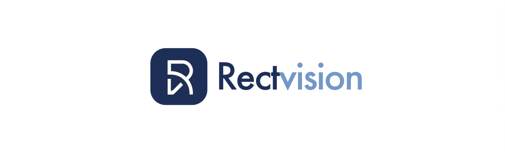

# rectvision



RectVision is a No code / Low code AI platform that helps users to build end to end computer vision/ NLP projects, from data to production.

## Installation
Rectvision supports an installation of Python 3.6 and above. It is available on Windows, MacOS and Linux Systems.

### pip (Recommended)
To install the current `rectvision` you'll need at least Python 3.6.1. If you have an older version of Python, you will not be able to use `rectvision`.

```shell
$ pip install --upgrade rectvision
```

Alternatively, you may download the wheels from [PyPi](https://pypi.org/project/rectvision/#files)


## Guide

```
visit: https://docs.rectvision.com/docs/intro
```
